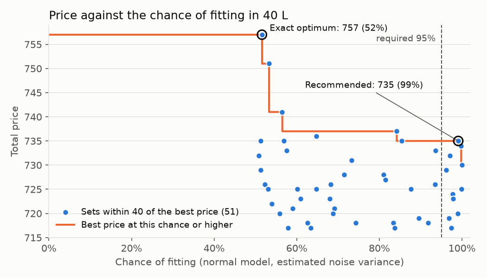
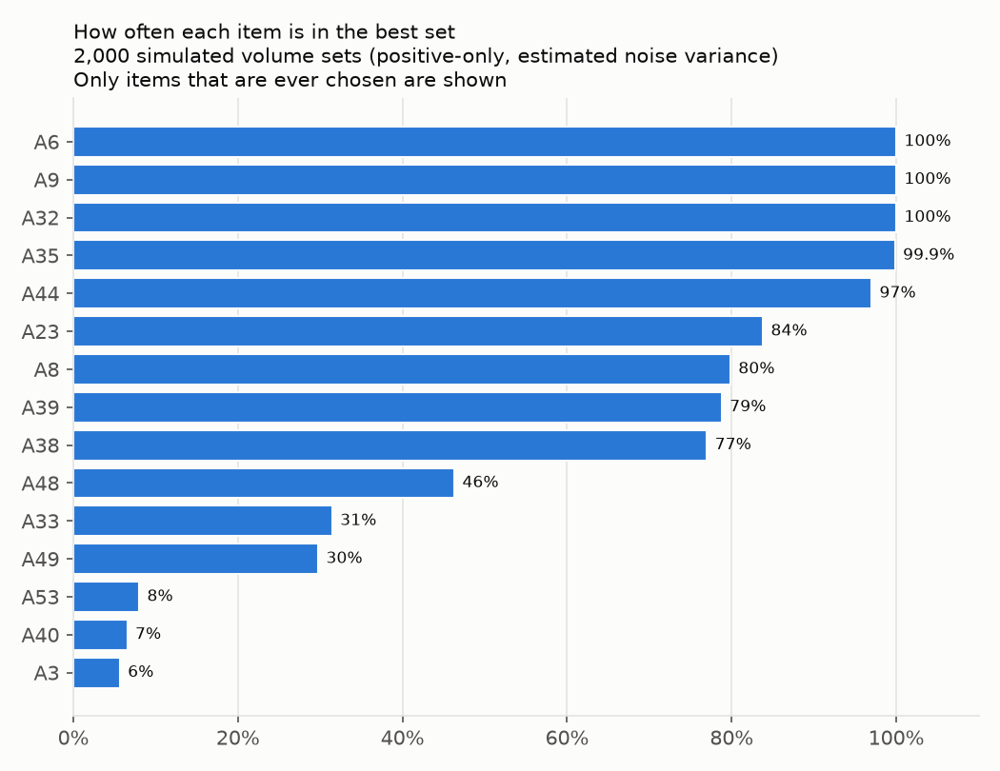

<!-- AI-drafted (Claude Code, Claude Opus 5.5). Author review: see DECISIONS.md. -->

# Zalando Gift Problem

> **AI use.** This work was done with an AI assistant: Claude Code, model Claude Opus 5.5, by Anthropic. The author supervised it step by step. Each section below keeps the **AI-assisted work** apart from the **author's decisions**. [DECISIONS.md](DECISIONS.md) has the full, dated log of every decision and who made it.
>
> Structure of this document: chosen by the author (log #10). Skeleton: AI-drafted.

## 1. Problem statement

### AI-assisted work

**Other readings of the task (step 3).** The AI computed what the other readings of the task would give, using the step 2 volumes. This is an AI addition beyond the agreed scope, approved by the author (log #39).

- **If an item could be picked more than once,** the best gift would be 106 copies of A6, priced 11,554 in total. That answer depends entirely on A6's volume estimate, which is by far the least certain relative to its size: 0.38 ± 0.29 L, about ±76%.
- **If the present had to be a single item,** it would be A14 or A49, both priced 119.

### Author's decisions

- "The most expensive present" means the set of items with the highest total price (log #38, AI proposal approved by the author).
- Each item can be picked at most once (log #31, AI proposal approved by the author).
- The gift fits if its total volume is at most 40 L; exactly 40 L is allowed. Volumes simply add up, with no packing loss (log #35, AI proposal approved by the author).
- The assumptions are stated here, in the problem statement (log #36, AI proposal approved by the author).

## 2. Methodology

### AI-assisted work

**Data preparation (step 1).** The AI wrote `gift/data.py` and its tests, `tests/test_data.py`. The code reads both JSON files and builds a 1000 × 60 table of 0s and 1s that records which items each package contains, together with the 1000 measured package volumes.

The program stops with an error unless all of these checks pass:

- item names are unique;
- every item in a package exists in `items.json`;
- no package lists the same item twice;
- no package is empty;
- every item appears in at least one package;
- the table has full rank, so all 60 item volumes can be estimated separately.

The AI also added three checks beyond the agreed list, which the author approved (log #20): prices are positive whole numbers, volumes are finite numbers, and both files have the expected structure.

`python -m gift.data` prints a summary of the data. The AI's findings from it:

- 15 item combinations appear more than once: 13 twice and 2 three times.
- Two packages have negative measured volumes: #663 at −0.85 L (A39 alone) and #790 at −0.34 L (A6 alone).

**Volume estimation (step 2).** The AI wrote `gift/estimate.py`, `gift/figures.py` and their tests, `tests/test_estimate.py`.

- **Model.** b = A v + e, where b holds the 1000 measured package volumes, A is the package-by-item table, v holds the 60 unknown item volumes, and e is independent Gaussian measurement noise with variance σ². There is no fixed volume per package.
- **Estimate.** Plain least squares gives v̂, which is the maximum-likelihood estimate under this noise model.
- **Noise variance.** Estimated from the residuals (measured volume minus the sum of the estimated item volumes) as σ̂² = RSS / (n − p), where n = 1000 packages and p = 60 items. The stated value is tested with a χ² test, and the variance gets a 95% confidence interval.
- **Uncertainty.** Cov(v̂) = σ²(AᵀA)⁻¹ gives a standard error for each item volume.
- **Four model checks:**
  1. *Fixed volume per package:* refit with a constant added and test whether it differs from 0 (t-test).
  2. *Scatter vs. number of items:* if item volumes varied from one unit to the next, packages with more items would scatter more. Tested by regressing squared standardized residuals on package size (Koenker's Breusch–Pagan test).
  3. *Normality of the residuals:* Shapiro–Wilk test.
  4. *Outliers:* count standardized residuals beyond 3 standard deviations, and test the largest with a Bonferroni correction over all 1000 packages.
- **Tests on made-up data with known volumes:**
  - without noise, the volumes are recovered exactly;
  - with noise of standard deviation 2, every estimate lies within 4 standard errors of the truth;
  - over 200 simulated data sets, the variance test rejects a true variance of 2 about 5% of the time, as it should, and always rejects when the standard deviation is 2;
  - each model check detects a problem planted on purpose.
- `python -m gift.estimate` prints the report and writes `results/volumes.csv`, `results/estimation.json` and the figures in `results/figures/`.
- Additions the AI made beyond the agreed outputs, approved by the author (log #29): `results/estimation.json`; the outlier count under the stated variance, for comparison; residuals scaled for leverage in the residual figure; a unit-price column in `volumes.csv`; and item labels on the extreme unit-price bars.

**Choosing the gift (step 3).** The AI wrote `gift/knapsack.py` and its tests, `tests/test_knapsack.py`. The problem is a 0/1 knapsack: maximise the total price subject to a total estimated volume of at most 40 L, with each item used at most once. It uses the step 2 volume estimates.

- **Exact table over total price (the proposed method).** Prices are whole numbers, and all 60 add up to 4,348. For every total price P from 0 to 4,348, the table stores the smallest total volume of any set whose prices add up to exactly P. It is filled one item at a time: a set with price P either skips the item, or uses it on top of the best set with price P minus the item's price. The answer is the largest P whose smallest volume fits in 40 L. No volume is rounded, so the answer is exact. The work is 60 items × 4,349 price levels = 260,940 table cells. It grows with the number of items times the sum of all prices, which suits whole-number prices like these.
- **Integer programming.** The same problem given to scipy's integer-programming solver (`milp`, HiGHS). It searches by branch and bound, using the version with fractional items to prune. Also exact. In the worst case it can take time exponential in the number of items, but it is fast in practice.
- **Greedy by unit price (comparison only).** Sort the items by price per litre and take each one that still fits. It takes 60 sorted items and 60 fit checks, but it is not guaranteed to find the best set.
- **Fractional upper bound.** The same greedy order, except the last item may be cut into a fraction. No real set can exceed it.
- **Near-optimal list.** A depth-first search lists every set that fits and costs within 40 of the best price. It cuts a branch only when even the fractional bound cannot reach that level, so no such set is missed.
- **Tests:**
  - both exact methods match brute force over all subsets on small random cases (300 cases for the table, 100 for integer programming);
  - on 200 cases, greedy never beats the optimum and the bound is never below it;
  - a two-item example shows greedy can be far off: 2 instead of 40;
  - the near-optimal list matches brute force;
  - integer programming matches the table on 100 larger random cases with 15 to 30 items;
  - edge cases: nothing fits, everything fits, a set of exactly 40 L, and ties, where the smaller volume wins;
  - float sums that land a hair over the capacity (0.1 + 0.2 = 0.30000000000000004) still count as fitting in every method;
  - the solver's result is re-checked against the capacity, because its own tolerance (about 10⁻⁷ L) is looser than this project's (10⁻⁹ L);
  - every method rejects a volume of 0 or below.
- `python -m gift.knapsack` prints the comparison and writes `results/knapsack.json`.

**Handling the uncertainty (step 4).** The AI wrote `gift/robust.py`, two chart functions in `gift/figures.py`, and `tests/test_robust.py`.

- **Uncertainty model.** With a flat prior, and the noise variance plugged in as if known, the true item volumes follow N(v̂, Cov), where Cov = σ²(AᵀA)⁻¹ comes from step 2.
- **Chance that a set fits in 40 L,** in two versions:
  - *Normal:* Φ((40 − estimated total volume) / sd). The sd of the total uses the full covariance, so how the item estimates move together counts.
  - *Positive-only:* the same chance, but from 100,000 simulated volume sets in which any item volume of 0 or below is thrown out, because volumes cannot be negative.
- **Rule:** the most expensive set with at least a 95% chance of fitting (normal version, estimated variance).
  - The search runs over the 51 sets from step 3. That is enough for the most expensive qualifying set. A set whose estimated volume is over 40 L has less than a 50% chance, so at 50% or above only sets that fit on the estimates can qualify. The list holds every such set priced 717 or more, so whenever it holds at least one qualifying set, the most expensive one is in it. (This argument covers the normal version. For the positive-only version, the AI checked that no set outside the list reaches 50%.)
  - The code widens the list if some level has no qualifying set.
  - A table repeats the rule at 50%, 80%, 90%, 95%, 99% and 99.9%, for both versions and both variances.
- **Winner's-curse check.** Choosing the best of many sets favours sets whose volumes happen to be underestimated, so the nominal (computed) chance of the chosen set can be optimistic.
  - The check simulates 2,000 new package data sets from the fitted model: the true volumes are the step 2 estimates, and the noise variance is 3.86.
  - For each data set it reruns the estimation, the near-optimal search and the rule, and counts how often the chosen set really fits.
  - At 95% the result is also split by the chosen set's nominal chance, to see where the optimism sits.
  - A simulated data set in which some estimated volume comes out at 0 or below would stop the real pipeline (log #24), so it is skipped and counted. These are exactly the data sets where A6 is underestimated, so skipping them makes the check slightly optimistic. As a sensitivity check, the 95% rule is also run on them with the non-positive estimates set to 0.0001 L.
- **Item stability (diagnostic).** For 2,000 simulated positive-only volume sets, the exact table finds the best set, and the code counts how often each item and each set wins. It also counts the draws in which several sets tie on the best price; the exact table then picks the smallest volume.
- **Tests:**
  - the formula reduces to the textbook one for a single item;
  - covariance between items changes the sd;
  - the normal chance matches a direct simulation to within 0.005;
  - positive-only draws are all positive, and they lower the chance of the 757 set, which contains A6;
  - choosing and tie-breaking, and widening the list when no set qualifies;
  - with no uncertainty, item stability always returns the exact optimum;
  - small stand-in problems show that the headline and expected-price columns use the normal version under the estimated variance, where the other variants would pick different sets;
  - the positive-only draws reproduce the intended covariance;
  - the real-data results are pinned, including all winner's-curse numbers.
- `python -m gift.robust` prints the report and writes `results/uncertainty.json` and two figures. It takes about a minute.
- Method details the AI chose, approved by the author (log #47): the truth and the skipping rule in the winner's-curse check, the sample sizes and seed, the output file, the frontier line and the second figure, the list of most frequent winning sets, the tie-break on price (the higher chance wins), the window doubling, the positive-only draws used for item stability, the split of the 95% check by nominal chance with the sensitivity run on skipped data sets, and the tie counting in item stability.

### Author's decisions

**Data preparation (step 1):**

- Item combinations that appear more than once are kept as separate measurements (log #16, AI proposal approved by the author).
- Any failed data check stops the program with a clear error (log #17, AI proposal approved by the author).
- The two negative volumes are kept as measurement noise (log #18, AI proposal approved by the author). A negative volume cannot happen in reality and would not appear in a real data set (log #18, the author's addition).

**Volume estimation (step 2):**

- The item volumes are estimated with plain least squares, and the program stops if any estimate is 0 or below (log #24, AI proposal approved by the author).
- A fixed volume per package is estimated, tested and reported, but left out of the model, because the task defines a package's volume as the sum of its items' volumes (log #25, AI proposal approved by the author).
- All four model checks are reported (log #26, AI proposal approved by the author).
- Outputs: the volume table and the residual histogram (log #27, AI proposal approved by the author), plus histograms of item price, estimated item volume and unit price (log #27, the author's addition).

**Choosing the gift (step 3):**

- The exact table over total price is the proposed method (log #32, AI proposal approved by the author).
- Integer programming and greedy are run as well, and all three are compared on their final result and computational effort (log #32, the author's).
- The author raised greedy by unit price (log #30). It serves only as a comparison to the proposed method, with the fractional upper bound and the gap explained (log #37, AI proposal approved by the author).
- Cross-checks: integer programming against the table on the real data, and brute force on small cases in the tests (log #33, AI proposal approved by the author).
- Every set within 40 of the best price is listed, for step 4 (log #34, AI proposal approved by the author).

**Handling the uncertainty (step 4):**

- The chance of fitting is reported in both versions, normal and positive-only (log #41, AI proposal approved by the author).
- The required chance is 95%, with a table from 50% to 99.9% (log #42, AI proposal approved by the author; the 95% rule itself dates from planning, log #4).
- The winner's-curse check is included (log #43, AI proposal approved by the author).
- Item stability is kept in the write-up as a diagnostic. The AI recommended it; the author decided after seeing the results (log #44).
- The figure of price against chance of fitting (log #45) and the one-line expected-price view (log #46) are included (both AI proposals approved by the author).

## 3. Results and discussion

### AI-assisted work

**Item volumes.** All 60 estimated volumes are positive. They range from 0.38 L (A6) to 29.67 L (A14), with standard errors of 0.23 to 0.29 L. The full table is in [`results/volumes.csv`](results/volumes.csv).

**Noise variance.** Each package's residual is its measured volume minus the sum of its items' estimated volumes. The residuals estimate the noise variance as the residual sum of squares divided by the degrees of freedom: 3628.96 / (1000 − 60) = **3.86**, a standard deviation of 1.96 L.

If the stated variance of 2 were true, RSS / 2 would follow a χ² distribution with 940 degrees of freedom, with mean 940 and standard deviation 43.4. The observed value is 1814.5, which is 20.2 standard deviations higher (two-sided p ≈ 9 × 10⁻⁵⁸). The 95% confidence interval for the variance is 3.53 to 4.23. It excludes 2 and contains 4.

The figure shows the residuals, each divided by √(1 − leverage) so that its variance equals the noise variance. The estimated noise curve fits them, while the stated one is visibly too narrow.

*The AI's interpretation (log #23):* the task says "variance=2" explicitly, but the data fit a variance of about 4, which is a **standard deviation** of 2. A likely explanation is that the data were generated with a call such as numpy's `np.random.normal(0, 2)`, whose second argument is the standard deviation, not the variance. The data cannot show how they were made.

**Model checks.** None of the checks points to another source of extra variation:

1. *Fixed volume per package:* −0.06 L (standard error 0.16, p = 0.71). Adding it would move no item volume by more than 0.02 L.
2. *Scatter vs. number of items:* slope +0.01 per item (p = 0.62). The scatter does not grow with package size.
3. *Normality:* Shapiro–Wilk p = 0.88, skewness +0.05, excess kurtosis −0.03.
4. *Outliers:* 3 packages lie beyond 3 standard deviations, where 2.7 are expected. The largest is package #44 at 3.81 standard deviations (Bonferroni p = 0.14). Under the stated variance there would be 32 such packages, the largest at 5.3 standard deviations. Those apparent outliers come from assuming the wrong variance.

**Unit price.** The unit price (price per litre) of most items lies between 1 and 20. Three small items stand far apart: A6 at 290 per litre, A32 at 87 and A9 at 67.

Why the unit price is not needed here, and where it helps (supporting the author's statement below):

- **Not needed here.** An exact optimisation compares whole sets of items against the 40 L limit, so it never needs to rank single items.
- **Misleading if used greedily.** Picking items in order of unit price is only guaranteed to be optimal when items can be split into fractions.
- **Fragile for small items.** A6's volume is 0.38 ± 0.29 L. Within one standard error, its unit price could be anywhere from about 165 to 1,225 per litre.
- **Useful for other problems.** It is a fast heuristic for very large problems, it gives an upper bound on the best price in branch-and-bound searches, and it is the exact solution when items can be split.

**The gift on the estimated volumes (step 3).** Results of the three methods and the fractional bound, from `results/knapsack.json`:

| Method | Price | Volume | Items | Median time | Work |
|---|---|---|---|---|---|
| Exact table (proposed) | **757** | 39.972 L | A6 A8 A9 A23 A32 A35 A38 A44 A48 | 1.5 ms | 260,940 table cells |
| Integer programming | **757** | 39.972 L | A6 A8 A9 A23 A32 A35 A38 A44 A48 | 46 ms | 1 branch-and-bound node |
| Greedy by unit price | 751 | 39.938 L | A6 A8 A9 A23 A32 A35 A38 A39 A44 A53 | 0.09 ms | 60 items sorted and checked |
| Fractional upper bound | 770.8 | 40 L | not a real set (last item cut) | – | – |

Times are the median of 20 runs (1,000 for greedy) on the author's laptop: Intel Core i7-10610U, Windows 11, Python 3.13. The table shows the run saved in `results/knapsack.json`. Across repeated runs on the same laptop, the times ranged from about 1 to 5 ms for the table, 26 to 160 ms for the solver and 0.04 to 0.3 ms for greedy, but the ranking never changed. The "Work" column counts different things for each method, so it is not comparable across rows.

- **Both exact methods find the same set:** price 757, total volume 39.972 L, leaving 0.028 L to spare. No other set reaches 757.
- **Greedy lands 6 below the optimum (0.8%).** It decides one item at a time and never reconsiders. It takes the nine items with the best price per litre, which use 34.32 L: A6, A32, A9, A39, A35, A44, A8, A23 and A38. The next item, A48 (81, 7.21 L), no longer fits in the 5.68 L left, so greedy skips it and later adds A53 (44). The optimum drops A39 (31, 1.56 L) to make room for A48. It trades A39 + A53 (75) for A48 (81).
- **The optimum is within 1.8% of the fractional upper bound,** so no whole-item set could do much better.
- **Computational effort.** At this size all three are fast.
  - The table is the fastest exact method here.
  - The solver needed no branching. At its first node, presolve, cutting planes and a built-in heuristic found 757 and proved it optimal. That work, not call overhead, is most of its time: a trivial one-variable problem takes only a few milliseconds through the same call.
  - Greedy is the fastest overall, but it is not exact.
  - For larger problems: the table grows with the number of items times the total of all prices; the solver can in the worst case grow exponentially with the number of items; greedy needs only a sort.
- **Many sets are close.** 51 sets fit and cost within 40 of the best price. The top five are 757, 751, 741, 737 and 736. The best set leaves only 0.028 L to spare, while each volume estimate is uncertain by about ±0.25 L. Step 4 deals with this.

**The gift under uncertainty (step 4).** From `results/uncertainty.json`:

| Set | Price | Estimated volume | sd of volume | Chance of fitting: normal | Positive-only | Normal, stated variance |
|---|---|---|---|---|---|---|
| Exact optimum on the estimates: A6 A8 A9 A23 A32 A35 A38 A44 A48 | 757 | 39.972 L | 0.71 L | **51.6%** | 49.1% | 52.2% |
| Recommended: A6 A8 A9 A32 A35 A38 A39 A44 A49 | 735 | 38.221 L | 0.75 L | **99.1%** | 99.0% | 99.95% |

- **The exact optimum is a coin flip.** It leaves 0.028 L to spare, and the uncertainty of its total volume is 0.71 L.
- **The most expensive set with at least a 95% chance** is priced 735. It costs 22 less (2.9%) and leaves 1.78 L to spare. Compared with the optimum, it drops A23 and A48 (91 + 81) and adds A39 and A49 (31 + 119).

Best price for each required chance:

| Required chance | Normal, estimated variance | Positive-only, estimated | Normal, stated variance 2 | Positive-only, stated |
|---|---|---|---|---|
| 50% | 757 (51.6%) | 751 (50.7%) | 757 (52.2%) | 757 (51.2%) |
| 80% | 737 (84.2%) | 737 (83.0%) | 737 (91.8%) | 737 (91.5%) |
| 90% | 735 (99.1%) | 735 (99.0%) | 737 (91.8%) | 737 (91.5%) |
| **95%** | **735 (99.1%)** | **735 (99.0%)** | **735 (99.95%)** | **735 (99.94%)** |
| 99% | 735 (99.1%) | 735 (99.0%) | 735 (99.95%) | 735 (99.94%) |
| 99.9% | 730 (99.95%) | 730 (99.95%) | 735 (99.95%) | 735 (99.94%) |

- **At the required 95%, all four columns give the same 735 set.** It is also the answer from 90% to 99% under the estimated variance, and from 95% to 99.9% under the stated one. One cell is close to its line: in the positive-only 99% cell, 99.04% clears 99% by only about 1.4 Monte Carlo standard errors.
- **Positive-only changes the choice only in the 50% row.** All 51 sets contain A6, and excluding negative volumes mainly raises A6's expected volume (by 0.054 L). That pushes the 757 set just below the line (49.1%), so 751 takes the row. From 80% up, the choice is the same in both versions.

**Winner's curse.** 2,000 data sets were simulated from the fitted model, and 1,810 were used:

| Required chance | Chosen sets' nominal chance (mean) | Share that actually fit (± 1 standard error) |
|---|---|---|
| 50% | 67.2% | 52.2% ± 1.2% |
| 80% | 90.3% | 81.8% ± 0.9% |
| 90% | 95.8% | 90.2% ± 0.7% |
| **95%** | **98.1%** | **95.2% ± 0.5%** |
| 99% | 99.7% | 99.0% ± 0.2% |
| 99.9% | 99.97% | 99.9% ± 0.1% |

- **The rule delivers what it promises.** Requiring at least 95% gives 95.2% in practice. Keeping the 190 skipped data sets (non-positive estimates set to 0.0001 L), 172 of them still fit, and the rate at 95% is 94.8% ± 0.5%. The same holds at the other levels: the actual share is close to the required level.
- **The nominal chance of the set chosen is optimistic, mostly just above the threshold.** At 95%, split by the chosen set's nominal chance:

  | Nominal chance of the chosen set | Data sets | Mean nominal | Actually fit |
  |---|---|---|---|
  | 95% to 97% | 473 | 96.0% | 90.1% ± 1.4% |
  | 97% to 99% | 653 | 98.1% | 95.3% ± 0.8% |
  | **99% to 99.5%** | 266 | **99.3%** | **97.7% ± 0.9%** |
  | 99.5% to 100% | 418 | 99.8% | 99.3% ± 0.4% |

  Sets chosen just above the line fit only about 90% of the time, against a printed 96%. For sets printed at 99–99.5%, like the recommended set's 99.1%, the actual rate was 97.7%. That is close in absolute terms, but the real risk of not fitting (about 2%) is still roughly two to three times the printed one (about 0.7%).
**Expected price** (one line, log #46): the set with the highest price × chance is a 734 set under the estimated variance (A6 A9 A23 A32 A35 A38 A39 A44 A48: 99.75%, 732.2 against 728.3 for the 735 set), and the 735 set under the stated variance. The recommendation rests on the 95% rule, not on this measure.

**Item stability** (a diagnostic, log #44). In 2,000 simulated volume sets, the exact optimum was one of 28 different sets.

- **Certain picks:** A6, A9 and A32 are in the best set every time, A35 in 99.9%, and A44 in 97%.
- **Items that depend on the noise:** A48 (46%), A33 (31%) and A49 (30%).
- **Most frequent winning sets:**
  - a 760 set with A33 (28.6%), which does not fit on the point estimates (40.26 L);
  - the 757 exact optimum (18.4%);
  - a 737 set (15.2%);
  - the recommended 735 set (11.4%).
- **Ties:** in 101 of the 2,000 draws, several sets tie on the best price, and the exact table picks the one with the smallest volume. Counting every tied set, the exact optimum reaches the best price in 18.45% of draws and the recommended set in 11.5%.

### Author's decisions

- **The stated noise variance of 2 is rejected** on the basis of the calculation above (log #19, the author's). The estimated variance is used for all uncertainty calculations, and the stated value is shown only for comparison (log #5, AI proposal approved by the author).
- The reading that 2 was meant as the standard deviation is included, labelled as the AI's interpretation (log #23, the author's decision to include it).
- **Unit price is not needed to solve this problem, but it can be useful for other problems** (log #28, the author's).
- The answer on the estimated volumes comes from the exact methods, and greedy is reported only for comparison (log #37, AI proposal approved by the author). All three methods are compared on result and computational effort (log #32, the author's).
- **Recommended gift: A6 A8 A9 A32 A35 A38 A39 A44 A49, total price 735, estimated volume 38.22 L, with a nominal 99.1% chance of fitting in 40 L.** It is the most expensive set with at least a 95% chance. The winner's-curse check shows that the 95% rule delivers about 95%, and that sets printed at 99–99.5% actually fit about 98% of the time. The exact optimum on the estimates (757, 39.97 L) is shown alongside with its risk: a 51.6% chance (log #4, #42, AI proposals approved by the author).
- **A near-equal, safer alternative: A6 A9 A23 A32 A35 A38 A39 A44 A48, price 734, estimated volume 37.98 L, with a nominal 99.75% chance of fitting.** It costs 1 less than the recommended set, and its nominal risk of not fitting is about a quarter as large (0.25% against 0.9%). In the winner's-curse check, sets printed at 99.5% or more actually fit 99.3% of the time. The recommendation stays with 735, because that is what the rule set in advance gives (log #50, the author's).
- **Computational time is not a problem at this size. For industry-size problems, though, it is always a good start to estimate the computational time of different solutions on a small data set, and then choose the most accurate and efficient one** (log #40, the author's).
