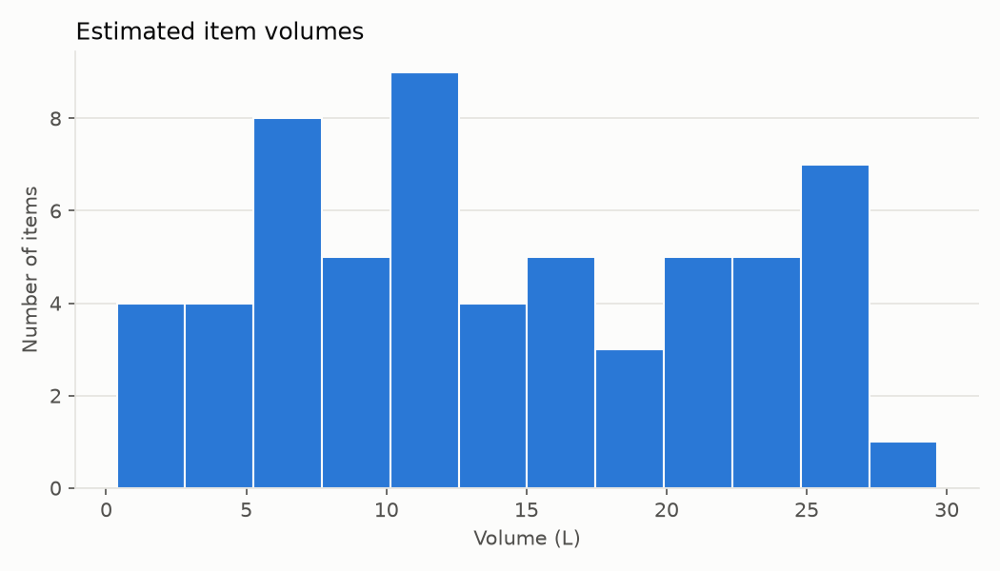
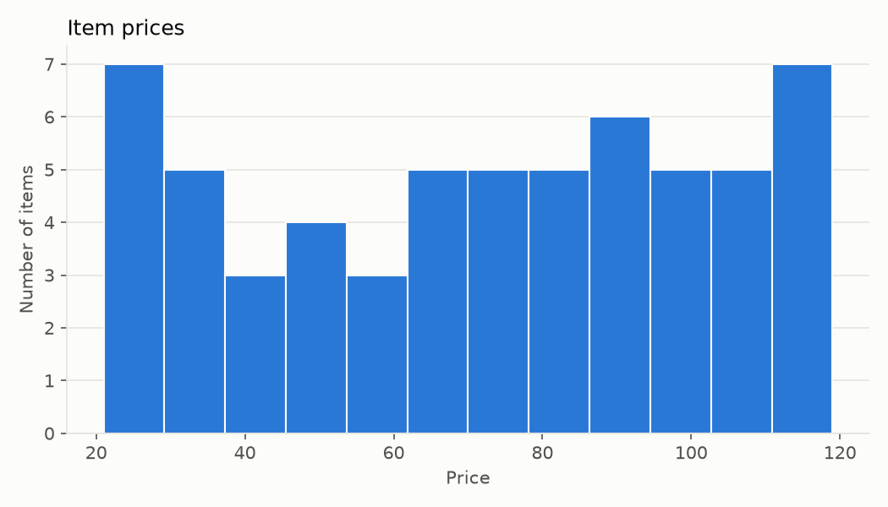
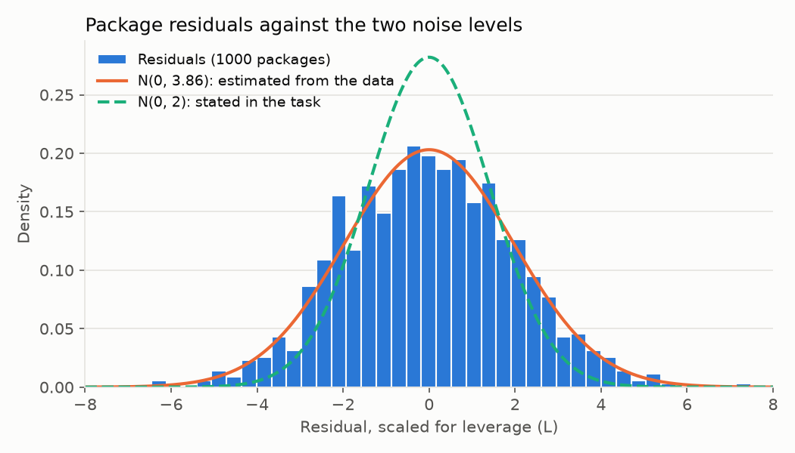
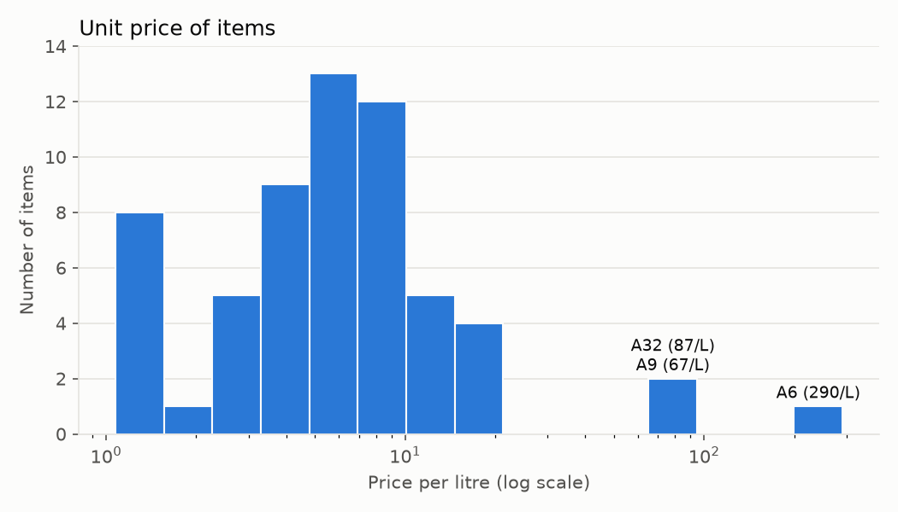

<!-- AI-drafted (Claude Code, Claude Opus 5.5). Author review: see DECISIONS.md. -->

# Zalando Gift Problem

> **AI use.** This work was done with an AI assistant: Claude Code, model Claude Opus 5.5, by Anthropic. The author supervised it step by step. Each section below keeps the **AI-assisted work** apart from the **author's decisions**. [DECISIONS.md](DECISIONS.md) has the full, dated log of every decision and who made it.
>
> Structure of this document: chosen by the author (log #10). Skeleton: AI-drafted.

## 1. Problem statement

### AI-assisted work

_To be written._

### Author's decisions

_To be written._

## 2. Methodology

### AI-assisted work

**Data preparation (step 1).** The AI wrote `gift/data.py` and its tests, `tests/test_data.py`. The code reads both JSON files and builds a 1000 × 60 table of 0s and 1s that records which items each package contains, together with the 1000 measured package volumes.

The program stops with an error unless all of these checks pass:

- item names are unique;
- every item in a package exists in `items.json`;
- no package lists the same item twice;
- no package is empty;
- every item appears in at least one package;
- the table has full rank, so all 60 item volumes can be estimated separately.

The AI also added three checks beyond the agreed list, which the author approved (log #20): prices are positive whole numbers, volumes are finite numbers, and both files have the expected structure.

`python -m gift.data` prints a summary of the data. The AI's findings from it:

- 15 item combinations appear more than once: 13 twice and 2 three times.
- Two packages have negative measured volumes: #663 at −0.85 L (A39 alone) and #790 at −0.34 L (A6 alone).

**Volume estimation (step 2).** The AI wrote `gift/estimate.py`, `gift/figures.py` and their tests, `tests/test_estimate.py`.

- **Model.** b = A v + e, where b holds the 1000 measured package volumes, A is the package-by-item table, v holds the 60 unknown item volumes, and e is independent Gaussian measurement noise with variance σ². There is no fixed volume per package.
- **Estimate.** Plain least squares gives v̂, which is the maximum-likelihood estimate under this noise model.
- **Noise variance.** Estimated from the residuals (measured volume minus the sum of the estimated item volumes) as σ̂² = RSS / (n − p), where n = 1000 packages and p = 60 items. The stated value is tested with a χ² test, and the variance gets a 95% confidence interval.
- **Uncertainty.** Cov(v̂) = σ²(AᵀA)⁻¹ gives a standard error for each item volume.
- **Four model checks:**
  1. *Fixed volume per package:* refit with a constant added and test whether it differs from 0 (t-test).
  2. *Scatter vs. number of items:* if item volumes varied from one unit to the next, packages with more items would scatter more. Tested by regressing squared standardized residuals on package size (Koenker's Breusch–Pagan test).
  3. *Normality of the residuals:* Shapiro–Wilk test.
  4. *Outliers:* count standardized residuals beyond 3 standard deviations, and test the largest with a Bonferroni correction over all 1000 packages.
- **Tests on made-up data with known volumes:**
  - without noise, the volumes are recovered exactly;
  - with noise of standard deviation 2, every estimate lies within 4 standard errors of the truth;
  - over 200 simulated data sets, the variance test rejects a true variance of 2 about 5% of the time, as it should, and always rejects when the standard deviation is 2;
  - each model check detects a problem planted on purpose.
- `python -m gift.estimate` prints the report and writes `results/volumes.csv`, `results/estimation.json` and the figures in `results/figures/`.
- Additions the AI made beyond the agreed outputs, approved by the author (log #29): `results/estimation.json`; the outlier count under the stated variance, for comparison; residuals scaled for leverage in the residual figure; a unit-price column in `volumes.csv`; and item labels on the extreme unit-price bars.

### Author's decisions

**Data preparation (step 1):**

- Item combinations that appear more than once are kept as separate measurements (log #16, AI proposal approved by the author).
- Any failed data check stops the program with a clear error (log #17, AI proposal approved by the author).
- The two negative volumes are kept as measurement noise (log #18, AI proposal approved by the author). A negative volume cannot happen in reality and would not appear in a real data set (log #18, the author's addition).

**Volume estimation (step 2):**

- The item volumes are estimated with plain least squares, and the program stops if any estimate is 0 or below (log #24, AI proposal approved by the author).
- A fixed volume per package is estimated, tested and reported, but left out of the model, because the task defines a package's volume as the sum of its items' volumes (log #25, AI proposal approved by the author).
- All four model checks are reported (log #26, AI proposal approved by the author).
- Outputs: the volume table and the residual histogram (log #27, AI proposal approved by the author), plus histograms of item price, estimated item volume and unit price (log #27, the author's addition).

## 3. Results and discussion

### AI-assisted work

**Item volumes.** All 60 estimated volumes are positive. They range from 0.38 L (A6) to 29.67 L (A14), with standard errors of 0.23 to 0.29 L. The full table is in [`results/volumes.csv`](results/volumes.csv).

**Noise variance.** Each package's residual is its measured volume minus the sum of its items' estimated volumes. The residuals estimate the noise variance as the residual sum of squares divided by the degrees of freedom: 3628.96 / (1000 − 60) = **3.86**, a standard deviation of 1.96 L.

If the stated variance of 2 were true, RSS / 2 would follow a χ² distribution with 940 degrees of freedom, with mean 940 and standard deviation 43.4. The observed value is 1814.5, which is 20.2 standard deviations higher (two-sided p ≈ 9 × 10⁻⁵⁸). The 95% confidence interval for the variance is 3.53 to 4.23. It excludes 2 and contains 4.

The figure shows the residuals, each divided by √(1 − leverage) so that its variance equals the noise variance. The estimated noise curve fits them, while the stated one is visibly too narrow.

*The AI's interpretation (log #23):* the task says "variance=2" explicitly, but the data fit a variance of about 4, which is a **standard deviation** of 2. A likely explanation is that the data were generated with a call such as numpy's `np.random.normal(0, 2)`, whose second argument is the standard deviation, not the variance. The data cannot show how they were made.

**Model checks.** None of the checks points to another source of extra variation:

1. *Fixed volume per package:* −0.06 L (standard error 0.16, p = 0.71). Adding it would move no item volume by more than 0.02 L.
2. *Scatter vs. number of items:* slope +0.01 per item (p = 0.62). The scatter does not grow with package size.
3. *Normality:* Shapiro–Wilk p = 0.88, skewness +0.05, excess kurtosis −0.03.
4. *Outliers:* 3 packages lie beyond 3 standard deviations, where 2.7 are expected. The largest is package #44 at 3.81 standard deviations (Bonferroni p = 0.14). Under the stated variance there would be 32 such packages, the largest at 5.3 standard deviations. Those apparent outliers come from assuming the wrong variance.

**Unit price.** The unit price (price per litre) of most items lies between 1 and 20. Three small items stand far apart: A6 at 290 per litre, A32 at 87 and A9 at 67.

Why the unit price is not needed here, and where it helps (supporting the author's statement below):

- **Not needed here.** An exact optimisation compares whole sets of items against the 40 L limit, so it never needs to rank single items.
- **Misleading if used greedily.** Picking items in order of unit price is only guaranteed to be optimal when items can be split into fractions.
- **Fragile for small items.** A6's volume is 0.38 ± 0.29 L. Within one standard error, its unit price could be anywhere from about 165 to 1,225 per litre.
- **Useful for other problems.** It is a fast heuristic for very large problems, it gives an upper bound on the best price in branch-and-bound searches, and it is the exact solution when items can be split.

### Author's decisions

- **The stated noise variance of 2 is rejected** on the basis of the calculation above (log #19, the author's). The estimated variance is used for all uncertainty calculations, and the stated value is shown only for comparison (log #5, AI proposal approved by the author).
- The reading that 2 was meant as the standard deviation is included, labelled as the AI's interpretation (log #23, the author's decision to include it).
- **Unit price is not needed to solve this problem, but it can be useful for other problems** (log #28, the author's).
